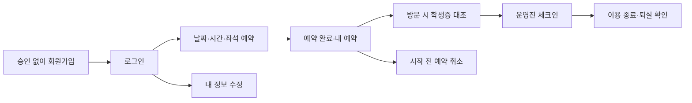

# 기능·데이터 설계

이 문서는 **목표 명세**입니다. 구현 완료 항목과 남은 작업은 [진행 현황](07-progress.md), 수정 전 상태는 [초기 진단](01-audit.md)을 참고합니다.

## 확정된 방향

운영자가 요청한 방향은 가입 사전 승인 제거, 회원정보 수정, 방문 시 학생증 대조입니다. 추가로 확인된 학생의 ‘내 예약 확인’ 부재를 개관 전 필수 기능에 포함합니다. 가입 성공은 대학 소속 확인 완료를 뜻하지 않으며, 시설 이용은 매 방문 때 학생증과 당일 예약 정보를 대조한 뒤 시작합니다.

## 1. 학생 기능

### 가입·로그인

- 입력: 학번, 이름, 비밀번호, 운영 이용수칙·개인정보 안내 확인. 학번 규격은 현행 9자리 정책을 유지할지 대학의 실제 이용 대상과 확인합니다.
- 서버가 학번 형식·중복·이름 공백·길이·비밀번호 정책을 검사합니다. 브라우저 검사만으로 처리하지 않습니다.
- 가입 후 즉시 로그인 가능. 화면에 ‘가입 후 예약할 수 있으며, 이용 당일 학생증을 확인합니다’를 표시합니다.
- `is_approved`에 따른 로그인 차단과 관리자 승인 목록을 제거합니다. 기존 승인 대기 계정은 정지 여부를 유지한 채 일반 가입 계정으로 이관합니다.
- 가입과 학내 인증을 별도 개념으로 취급합니다. 학교 이메일 인증·학사정보 연동은 현재 요구가 아니며 임의로 외부 조회를 추가하지 않습니다.
- PIN 원문을 저장하거나 관리자에게 보여주지 않습니다. 학생 가입·변경은 숫자 6자리만 허용하고 로그인·가입 시도 제한을 적용합니다. 운영자 비밀번호는 12~128자 정책을 유지합니다.

### 내 예약 — 가장 먼저 필요한 학생 화면

상단 메뉴에서 언제든 ‘내 예약’에 접근할 수 있어야 합니다. 예약 성공 후에는 알림만 띄우고 새로고침하는 대신 새 예약 상세 또는 내 예약 화면으로 이동합니다.

| 표시 항목 | 요구사항 |
| --- | --- |
| 다음 예약 | 예약 번호, 한국 시간 날짜·요일, 시작·종료, 좌석 번호, 상태 |
| 당일 안내 | 위치, 학생증 지참, 입실 방법, 취소 가능 여부 |
| 목록 | 예정·이용 중을 먼저 표시하고 지난 이용·취소 기록도 조회 |
| 예약 취소 | 자신의 아직 시작하지 않은 예약만 취소. 확인 후 즉시 상태와 좌석 점유 반영 |
| 빈 상태 | ‘예정된 예약이 없습니다’와 예약하기 링크 |
| 오류 | 조회 실패 안내와 다시 시도. 로그인 만료 시 로그인 안내 |

학생 A가 학생 B의 예약 ID를 주소나 요청에 넣어도 조회·취소할 수 없어야 합니다. 학번을 요청 파라미터로 받아 조회하는 대신 로그인한 계정의 내부 ID로 제한합니다. 다른 사용자의 존재 여부를 불필요하게 드러내지 않도록 404 또는 일관된 접근 거절을 반환합니다.

취소는 레코드를 삭제하지 않고 상태·취소 시각·주체를 기록합니다. 취소 후 재예약은 기존 하루 1건 규칙의 ‘활성 예약’ 기준에 맞추어 허용하는 안을 권장합니다. 이미 시작했거나 체크인한 예약의 취소는 운영진 처리로 분리합니다.

### 내 정보 수정·비밀번호 복구

- 이름과 학번 수정 화면을 제공합니다. 학번 변경에는 현재 비밀번호 재확인과 중복 검사를 적용합니다.
- 예약·제재·방문 이력은 변경되지 않는 `Student.id`에 연결합니다. 학번·이름 변경으로 노쇼 제재나 이용 제한이 사라지면 안 됩니다.
- 변경 이벤트에 변경 시각과 처리자를 기록합니다. 완료된 방문의 당시 정보는 보존하고, 예정 예약의 화면과 당일 학생증 대조에는 최신 정보를 사용합니다.
- 학생증 정보와 다르면 체크인을 보류하고 본인 정보를 정정하게 합니다. 기존 ‘확인됨’ 표시를 새 정보에 그대로 적용하지 않습니다.
- 다른 사람이 학번을 먼저 등록한 경우 운영진이 학생증으로 확인한 뒤 계정 복구 절차를 진행합니다. 가입된 학번이라는 이유로 비밀번호나 기존 이용내역을 알려주면 안 됩니다.
- 연락처를 수집하지 않는 초기 버전에서는 분실 비밀번호를 자동으로 찾아줄 수 없습니다. 현장 본인 확인 후 일회용·만료형 재설정으로 연결하고 사용자가 새 비밀번호를 정하도록 설계합니다.

## 2. 예약 규칙

| 규칙 | 현재 코드·화면 | 목표 |
| --- | --- | --- |
| 좌석 | 화면 27석 / 모델 주석 28석 | 실제 좌석 목록을 확정하고 DB·화면에서 공유 |
| 시간 | 학생 화면 09–17시 | 운영진 확정값을 서버 설정의 단일 기준으로 사용 |
| 기간 | UI에서 오늘부터 +7일 | 기준을 확정한 뒤 서버에서도 제한 |
| 최대 시간 | 기본 3시간, 관리자가 변경 가능 | 선택 옵션·안내·검증이 같은 값을 사용 |
| 학생별 제한 | 하루 활성 예약 1건 | 초기 유지 제안. 취소 후 재예약 허용 |
| 지난 시간 | 서버 제한 없음 | 과거 날짜와 이미 시작된 시간 차단 |
| 중복 | 먼저 조회한 후 insert | 같은 좌석·시간에 DB 수준에서 한 예약만 확정 |
| 차단 | 날짜·시간 전체 차단 | 휴실·수업·행사와 특정 좌석 고장 차단을 구분 |
| 제재 | 로그인 때만 수동 정지 확인 | 예약 생성·체크인 시 재확인 |

동일한 검증 함수를 가용성 조회와 예약 생성에 사용하되, 조회 결과는 확정이 아닙니다. 최종 생성 트랜잭션에서 다시 확인해야 합니다. 예약 창이 열려 있는 동안 조건이 바뀌면 친절한 안내와 최신 좌석 상태를 제공합니다.

통신 중 예약 버튼을 잠그고, 서버는 재전송에 대한 중복 생성 방지를 제공합니다. 시간대는 `Asia/Seoul`로 계산하고 저장 시각은 UTC로 통일합니다. 영업일·공휴일·방학 일정은 운영진이 정합니다.

## 3. 방문·퇴실·노쇼

운영 화면의 첫 화면은 ‘오늘 예약’과 학생 검색입니다. 차트보다 입실 대기·이용 중·종료 예정·미처리 건을 먼저 보여줍니다.

1. 당일 예약을 찾고 학생증의 학교·이름·학번과 현재 계정 정보를 대조합니다.
2. 예약 날짜·상태·좌석·이용 제한을 확인하고 체크인합니다. 학생증 사진 업로드·보관 기능은 만들지 않습니다.
3. `checked_in_at`, `checked_in_by`를 기록합니다. 같은 체크인 재전송은 중복 처리하지 않습니다.
4. 종료 시 정리 상태와 로그아웃을 확인하고 `checked_out_at`, `checked_out_by`를 기록합니다. 조기 퇴실에 따른 슬롯 재개방은 별도 정책이 정해지기 전까지 자동 적용하지 않습니다.
5. 운영 종료 시 미처리 예약을 확인합니다. 담당자의 방문 확인 누락을 즉시 노쇼로 단정하지 않습니다.

권장 상태 전이는 `reserved → checked_in → completed`, `reserved → cancelled`, `reserved → no_show`입니다. `no_show`는 정해진 기준과 운영진 확인으로 확정합니다. 취소·노쇼·완료 상태를 일반 체크인 버튼으로 되살리지 않습니다. 정정은 사유·처리자·시각을 남기는 별도 작업입니다.

지각 유예 시간, 노쇼 제재 기간, 이의 신청 처리 기준, 정지 시 이미 잡힌 예약의 처리 방식은 [결정 목록](06-launch-plan.md)에 남겨 둡니다. 초기에는 자동 제재보다 운영진 확정 후 적용을 권장합니다.

## 4. 권한 경계

| 작업 | 학생 | 현장 운영진(제안) | 관리자 |
| --- | --- | --- | --- |
| 실습실 소개·공지 | 조회 | 조회 | 수정 |
| 자기 정보·예약 | 조회·허용된 수정/취소 | 본인 권한 범위 | 지원 처리 |
| 다른 학생 비밀번호 | 접근 불가 | 접근 불가 | 접근 불가, 재설정만 |
| 당일 학생·예약 검색 | 접근 불가 | 업무 범위 조회 | 조회 |
| 체크인·퇴실 | 접근 불가 | 처리 | 처리·정정 |
| 장기 제재·직원 권한·시스템 설정 | 접근 불가 | 별도 부여 전 불가 | 처리 |

원본은 Admin/Student 두 모델뿐입니다. 초기 수정은 모든 관리 경로의 관리자 검사를 확실히 하고, 여러 교대 근무자를 두는 시점에 개별 운영진 계정과 역할을 도입합니다. 공용 관리자 비밀번호 공유를 인수인계 방식으로 삼지 않습니다.

## 5. 데이터와 변경 절차

아래는 권장 모델이며 기존 DB에 바로 존재하는 필드가 아닙니다.

- `Student`: 고정 내부 ID, 고유 학번, 이름, 비밀번호 해시, 계정 상태, 제재 기한, 생성·수정 시각. 가입 승인 상태 제거.
- `Reservation`: 학생 내부 FK, 좌석 FK, 이용 날짜·시간, 명시적 상태, 생성·취소·입퇴실 시각, 처리자. 방문 당시 정보는 제한된 스냅샷으로 보존.
- `Seat`: 번호, 구역, 성능 분류, 사용 가능 상태. 고장 차단은 기간과 사유를 별도로 기록.
- `ReservationSlot`: 예약 ID, 영업일, 좌석, 정수 시간 슬롯. `(date, seat_id, hour)` 유일성으로 점유 중복 방지. 취소 시 해당 점유만 해제하고 예약 이력은 유지.
- 학생의 하루 활성 예약 1건은 별도 점유 테이블의 `(student_id, date)` 유일성 등 DB에서 보장하는 방법을 사용합니다. 두 점유와 예약을 한 트랜잭션으로 변경합니다.
- `AuditEvent`: 정보 수정·방문 정정·예약 취소·제재 등의 주체·대상·사유·시각. 비밀번호와 학생증 이미지는 기록하지 않음.
- 운영 설정: 시간대, 영업시간, 최대 예약 시간, 예약 가능 기간, 운영 여부, 수업·휴실 일정.

이관 순서: 운영 DB 백업 → 복사본에서 스키마 조사 → 새 FK 필드 추가 → 기존 학번으로 학생 연결 → 연결 불가·중복 데이터 보고 → 정정 후 FK와 제약 적용 → 승인 대기 이관 → PIN 원문 제거 → 검증 → 배포. 기존 `Reservation.student_id`의 문자열 의미를 그대로 정수 FK로 바꾸면 안 됩니다.

`db.create_all()`은 기존 테이블을 갱신하지 않으므로 모델 수정만으로 이관이 끝나지 않습니다. 버전 관리되는 마이그레이션이 필요합니다. [Flask-SQLAlchemy 공식 설명](https://flask-sqlalchemy.palletsprojects.com/en/stable/quickstart/)

## 6. 제안 경로와 완료 기준

제안 경로: 공개 `/`, 예약 `/reserve`, 자기 예약 `/my/reservations`, 상세 `/my/reservations/<id>`, 취소 POST `/my/reservations/<id>/cancel`, 정보 `/account`, 비밀번호 변경 POST `/account/password`. 기존 `/api/availability`, `/api/reserve`는 검증·응답 규약을 강화해 유지할 수 있습니다.

완료 테스트는 다음 실제 행동을 검증합니다.

- 신규·기존 대기 계정 모두 승인 없이 로그인하고 예약·내 예약 조회 가능.
- 예약 성공 후 상세 표시, 새로고침·재로그인 후에도 조회 가능.
- 학생 A가 B의 상세 조회·취소 및 모든 관리 기능에 접근할 수 없음.
- 정상 취소 후 상태·좌석 점유·하루 제한이 일관되게 바뀜.
- 프로필 변경 후에도 같은 예약의 소유자·제재 이력이 유지됨.
- 과거·운영시간 밖·미존재 좌석·잘못된 JSON·차단 시간은 서버에서 거절.
- 동일 좌석 동시 요청과 동일 학생 동시 요청 각각 정확히 1건만 확정.
- 정지 중 새 예약 차단, 당일 아닌 체크인 차단, 체크인 중복 요청 무해.
- 담당자 누락과 확정 노쇼 구분, 정정 이력 확인.
- 실제 이관된 DB 복사본에서 이전 회원·예약이 보존됨.
